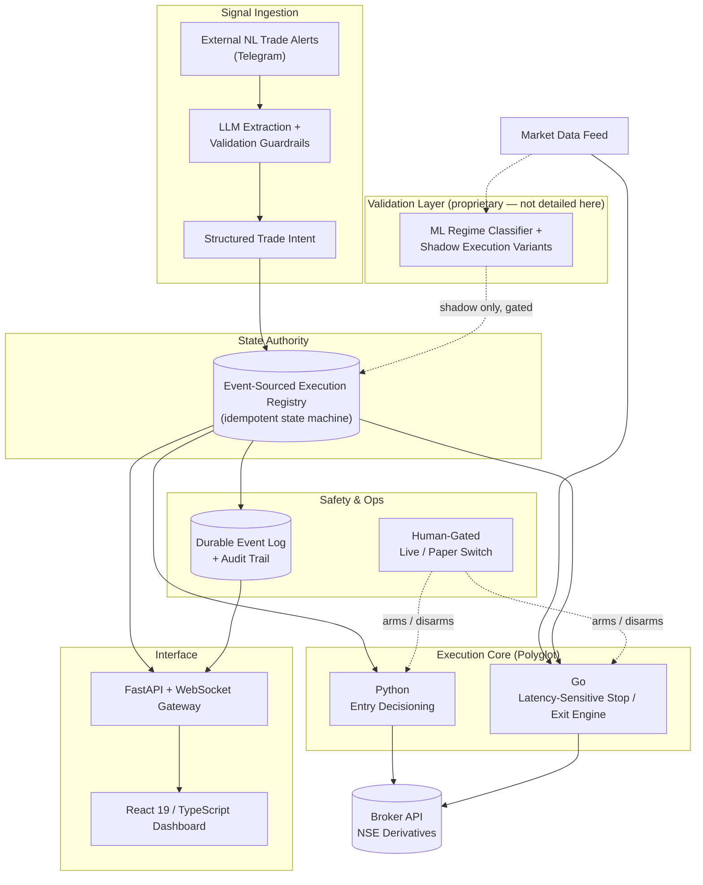

# DeltaLock — LLM-Driven Signal Extraction & Hybrid Execution Engine

**A solo-built automated execution system for NSE index/stock options that treats trade-signal generation as an arbitrary external input, and puts all of its engineering into converting that input into safe, disciplined, unattended execution.**

> **This is a portfolio overview repository.** DeltaLock is a private, working trading system. Its source code, extraction pipeline internals, execution parameters, and risk configuration are not published here or anywhere public. This repository documents the engineering — architecture, safety design, and the problems solved — not the trading methodology, and not the origin of any specific trade idea.

---

## Project Overview

DeltaLock ingests unstructured, natural-language trade alerts from an external channel (Telegram), converts them into validated, structured trade intents through an LLM-based extraction pipeline, and executes them through a polyglot Python + Go engine — with no human in the loop once a position is live.

The engineering thesis behind the project is deliberately narrow: **signal quality is treated as a given, not a variable.** DeltaLock does not attempt to generate or improve the underlying trade idea — that already exists, elsewhere, before the system ever sees it. What the system is entirely responsible for is everything downstream of that: can an arbitrary, unverified, natural-language directional call be safely, automatically, and consistently converted into a well-managed trade? That question — not signal research — is what this repository is about.

## Motivation

Most automated-trading portfolio projects concentrate their effort on the signal: a model, an indicator, an edge. DeltaLock inverts that emphasis on purpose. It exists to test a different, and in some ways harder, engineering problem: whether a sufficiently disciplined extraction, guardrail, and execution layer can make an average-quality, uncontrolled input source tradeable — safely, unattended, and without a human validating each alert. That constraint shaped the architecture end to end: an LLM sits at the ingestion boundary specifically because the input is unstructured and adversarial-by-default (inconsistent formatting, duplicates, partial updates), and a dedicated low-latency execution path exists specifically because the *quality* of stop and exit management matters more here than in a system that already starts from a strong signal.

## By the Numbers

| Metric | Value |
|---|---|
| Codebase | ~48,700 lines of Python, TypeScript, and Go across 268+ files |
| Automated tests | 32 pytest modules, including regression tests written directly from real production incidents |
| Execution core | Polyglot: Python owns ingestion, entry, and state authority; Go owns latency-sensitive stop/exit management |
| Signal source | Unstructured, natural-language trade alerts, parsed via an LLM-based extraction pipeline with validation guardrails |
| Market | NSE index and stock options, via live brokerage API integration |
| Deployment | Docker Compose, plus native unattended Windows operation |

*(Statistics describe engineering scope and testing rigor only — no strategy performance figures, such as returns, win rate, or drawdown, are published here or anywhere publicly, by design.)*

## High-Level Architecture

**Deliberately excluded from this diagram:** extraction-guardrail logic, entry/exit trigger conditions, stop-management methodology, and every parameter of the regime classifier. What's shown is the shape of the plumbing, not the logic flowing through it.

## Engineering Challenges

- **Turning unstructured language into a safe, structured action.** The system has no control over its input format — alerts arrive as free-form text, with duplicates, partial corrections, and inconsistent phrasing. An LLM-based extraction stage converts each message into a schema-validated trade intent, with guardrails that reject duplicate, malformed, or low-confidence signals before any execution logic ever sees them.
- **Polyglot execution for latency-sensitive decisions.** Python owns ingestion, entry, and state — where correctness and readability matter most. A purpose-built Go service owns stop and exit management, where consistent low-latency response to tick data matters most. Splitting ownership this way avoided rewriting the whole system in a systems language while still getting the latency-sensitive path out of Python's interpreter/GC path.
- **Crash-safe, replay-recoverable state.** Every lifecycle event is written to a durable, append-only log before it is processed. State lives in an idempotent registry, not in memory — so a mid-session crash or restart reconstructs exact trade state by replaying the log, rather than losing or duplicating a position.
- **Validating new logic without live risk.** Multiple execution variants run in parallel simulation against every live signal; only one variant is ever gated to touch real capital, and that gate is an explicit, human-controlled switch with no silent fallback in either direction.
- **Making failures investigable, not just survivable.** A structured, persisted audit trail (with a dedicated log-explorer UI) plus a regression-test suite built directly from real production incidents — not hypothetical ones — turned every past failure into a permanent guard against its recurrence.

## Technology Stack

**Backend** — Python 3.11+ (FastAPI, asyncio), Go (execution core), live brokerage REST/WebSocket integration
**Signal Ingestion** — Telegram client integration, LLM-based extraction (Google Gemini)
**ML** — LightGBM (experimental market-regime classifier, shadow/validation mode only)
**Frontend** — React 19, TypeScript, Vite, Tailwind CSS, Zustand, Recharts
**Persistence** — durable append-only event log for crash recovery, structured audit trail
**Testing** — pytest — 32 modules, including incident-derived regression tests
**Deployment** — Docker Compose, native Windows unattended launchers

## Screenshots

*(To be added — captured from paper-mode sessions only, scrubbed of any real account, position, or P&L data. No raw signal-source content, configuration values, or code views will be shown.)*

Planned: dashboard overview (layout only), audit-log explorer UI, system status/connectivity panel, architecture diagram render, test-suite pass summary.

## Future Work

- Extend the regime-classification layer beyond shadow/validation mode
- Broaden automated observability around the execution core
- Additional signal-source and broker integrations behind the same extraction/execution boundary

## What This Repository Is Not

This is a documentation-only showcase. It does not include: the extraction pipeline's prompts or guardrail logic, entry/exit trigger conditions, stop-management methodology, risk or sizing configuration, credentials, or any historical performance data. Those remain in a private repository.

---

Built solo by Aditya Magar. Get in touch via the contact details on my resume/LinkedIn.
