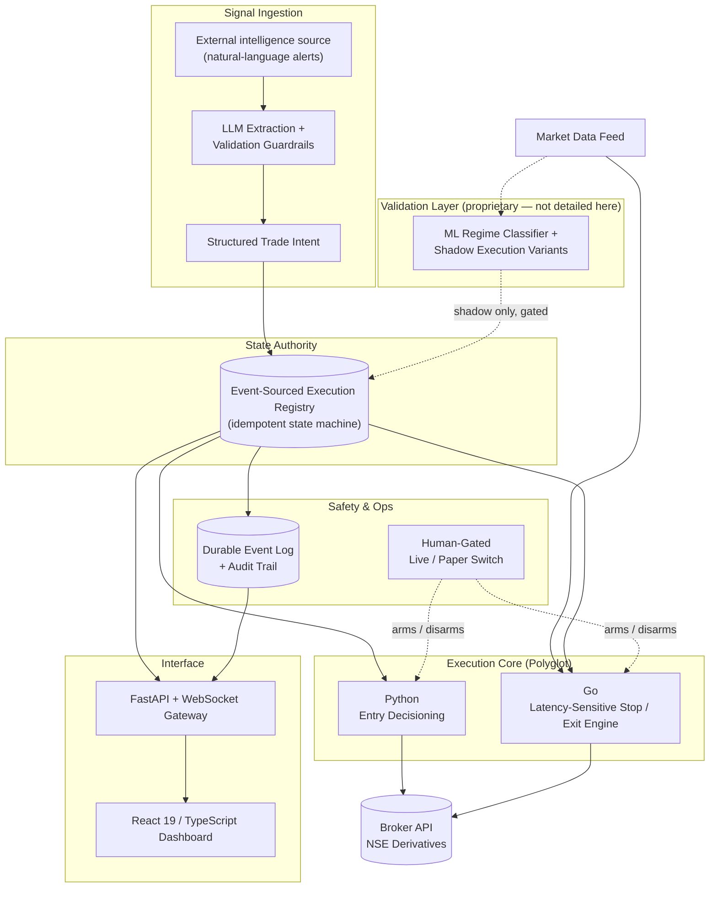

# DeltaLock: LLM-Driven Signal Extraction & Hybrid Execution Engine

**An automated execution system for NSE index/stock options that treats trade-signal generation as an arbitrary external input, and puts all of its engineering into converting that input into safe, disciplined, unattended execution.**

> **This is a portfolio overview repository.** DeltaLock is a private, working trading system. Its source code, extraction pipeline internals, execution parameters, and risk configuration are not published here or anywhere public. This repository documents the architecture, safety design and engineering problems solved. Trading methodology and the origin of trade ideas remain private.

---

## Project Overview

DeltaLock ingests unstructured, natural-language trade alerts from an external intelligence source, converts them into validated, structured trade intents through an LLM-based extraction pipeline, and executes them through a polyglot Python + Go engine, with no human in the loop once a position is live.

The engineering thesis behind the project is deliberately narrow: **signal quality is treated as a given, not a variable.** DeltaLock does not attempt to generate or improve the underlying trade idea. That already exists before the system sees it. What the system is entirely responsible for is everything downstream of that: can an arbitrary, unverified, natural-language directional call be safely, automatically, and consistently converted into a well-managed trade? That execution problem is what this repository documents.

## Motivation

Most automated-trading portfolio projects concentrate their effort on the signal: a model, an indicator, an edge. DeltaLock inverts that emphasis on purpose. It exists to test a different, and in some ways harder, engineering problem: whether a sufficiently disciplined extraction, guardrail, and execution layer can make an average-quality, uncontrolled input source tradeable while running unattended, without a human validating each alert. That constraint shaped the architecture end to end: an LLM sits at the ingestion boundary specifically because the input is unstructured and adversarial-by-default (inconsistent formatting, duplicates, partial updates), and a dedicated low-latency execution path exists specifically because the *quality* of stop and exit management matters more here than in a system that already starts from a strong signal.

## By the Numbers

| Metric | Value |
|---|---|
| Codebase | 444 tracked source files: 249 Python, 26 Go, 39 React/TypeScript components |
| Automated tests | 50 pytest modules, including regression tests written directly from real production incidents |
| Execution core | Polyglot: Python owns ingestion, entry, and state authority; Go owns latency-sensitive stop/exit management |
| Signal source | Unstructured, natural-language trade alerts, parsed via an LLM-based extraction pipeline with validation guardrails |
| Market | NSE index and stock options, via live brokerage API integration |
| Deployment | Docker Compose, plus native unattended Windows operation |

*(Statistics describe engineering scope and testing rigour only; no strategy performance figures, such as returns, win rate, or drawdown, are published here or anywhere publicly, by design.)*

## High-Level Architecture

**Deliberately excluded from this diagram:** extraction-guardrail logic, entry/exit trigger conditions, stop-management methodology, and every parameter of the regime classifier. What's shown is the shape of the plumbing, not the logic flowing through it.

## Engineering Challenges

- **Turning unstructured language into a safe, structured action.** The system has no control over its input format. Alerts arrive as free-form text, with duplicates, partial corrections, and inconsistent phrasing. An LLM-based extraction stage converts each message into a schema-validated trade intent, with guardrails that reject duplicate, malformed, or low-confidence signals before any execution logic ever sees them.
- **Polyglot execution for latency-sensitive decisions.** Python owns ingestion, entry and state, where correctness and readability matter most. A purpose-built Go service owns stop and exit management, where consistent low-latency response to tick data matters most. Splitting ownership this way avoided rewriting the whole system in a systems language while still getting the latency-sensitive path out of Python's interpreter/GC path.
- **Crash-safe, replay-recoverable state.** Every lifecycle event is written to a durable, append-only log before it is processed. An idempotent registry persists state, and a restart rebuilds recorded trade state by replaying the log.
- **Validating new logic without live risk.** Multiple execution variants run in parallel simulation against every live signal; only one variant is ever gated to touch real capital, and that gate is an explicit, human-controlled switch with no silent fallback in either direction.
- **Making failures investigable, not just survivable.** A persisted audit trail, a log-explorer UI and regression tests derived from production incidents make failures traceable and check the fixes against recurrence.

## Documentation

The engineering detail lives in `docs/`, and each document stops where the strategy begins.

| Document | What is in it |
|---|---|
| [docs/ORDER-LIFECYCLE.md](docs/ORDER-LIFECYCLE.md) | The order-lifecycle state machine, a sequence diagram of one signal end to end, why entry and exit authority are split across two languages, and how recovery works |
| [docs/DURABILITY.md](docs/DURABILITY.md) | The append-ahead event log, quoted from the real implementation: fsync on the write path, idempotent replay, event-id collision handling, and the partial-fill bug that shaped the API |
| [docs/INVARIANTS.md](docs/INVARIANTS.md) | The invariants the system may never violate, reproduced from the private repository with the trading rules removed |
| [docs/INCIDENT-2026-07-15.md](docs/INCIDENT-2026-07-15.md) | A full post-mortem of a live exit that never reached the broker. Two root causes, one of them the kind that leaves the system looking perfectly consistent while being wrong |
| [DISCLOSURE.md](DISCLOSURE.md) | What is published here, what never will be, and the line between them |

## Test suite

50 pytest modules. The convention across the suite is that a failure in production ships its fix
with a test named for the day it happened, so the same failure cannot return quietly. The
date-suffixed modules below are all real incidents.

| Module | What it asserts |
|---|---|
| `test_incident_2026_07_15_live_exit.py` | Both root causes of the live exit that never reached the broker. See the post-mortem |
| `test_production_hardening_2026_07_10.py` | Each fix from a pre-live readiness audit, by constructing the exact failure state the fix targets rather than checking that the system boots |
| `test_feed_starvation_2026_08_17.py` | That the system refuses to act on stale market data. In the original incident nothing crashed and no component was wrong, which is why it ran on a market that had stopped updating |
| `test_durability_hardening_2026_08_17.py` | Three backstops that stop a long session degrading, including a sweep for trades left alive after a fill event was missed |
| `test_never_short_2026_08_17.py` | That the system is structurally long-only. An uncovered sell on an index option is a naked short with unbounded loss, so this has to be impossible by construction rather than merely absent from the current call graph |
| `test_stream_isolation_2026_08_17.py` | That the parallel execution variants never bleed into one another, and that exactly one of them can reach live capital |
| `test_no_duplicate_initial_sl_2026_08_18.py` | That one long position can never carry two protective stops, after an incident where two went out a second apart |
| `test_already_covered_sell_2026_08_18.py` | That holding a long is not by itself permission to sell, because the long may already be committed to a protective order that is currently working |
| `test_tick_path_starvation_2026_09_04.py` | That state persistence cannot starve the tick path. Persisting the registry inline on the calling thread measured around 400 ms and was being called once a second per trade |
| `test_state_roundtrip.py` | That serialisation preserves every field, so a restart cannot silently reset state that a dropped field would have reset |
| `test_fifo_purge.py` | Retention behaviour of the local event store under a purge |

The remaining modules cover the extraction pipeline, market data handling, the analytics layer
and the strategy internals. They are not listed here, because their names alone describe
trading behaviour.

## Technology Stack

**Backend:** Python 3.11+ (FastAPI, asyncio), Go (execution core), live brokerage REST/WebSocket integration
**Signal Ingestion:** external intelligence source, LLM-based extraction (Google Gemini)
**ML:** LightGBM (experimental market-regime classifier, shadow/validation mode only)
**Frontend:** React 19, TypeScript, Vite, Tailwind CSS, Zustand, Recharts
**Persistence:** durable append-only event log for crash recovery, structured audit trail
**Testing:** pytest, 50 modules, including incident-derived regression tests
**Deployment:** Docker Compose, native Windows unattended launchers

## Screenshots

*(To be added, captured from paper-mode sessions only and scrubbed of any real account,
position or profit and loss data. No raw signal content, configuration values or code views will
be shown.)*

Planned: dashboard overview (layout only), audit-log explorer UI, system status/connectivity panel, architecture diagram render, test-suite pass summary.

## Future Work

- Extend the regime-classification layer beyond shadow/validation mode
- Broaden automated observability around the execution core
- Additional signal-source and broker integrations behind the same extraction/execution boundary

## What This Repository Is Not

This is a documentation-only showcase. It does not include: the extraction pipeline's prompts or guardrail logic, entry/exit trigger conditions, stop-management methodology, risk or sizing configuration, credentials, or any historical performance data. Those remain in a private repository.

---

Built by Aditya Magar. Get in touch via the contact details on my CV or LinkedIn.
