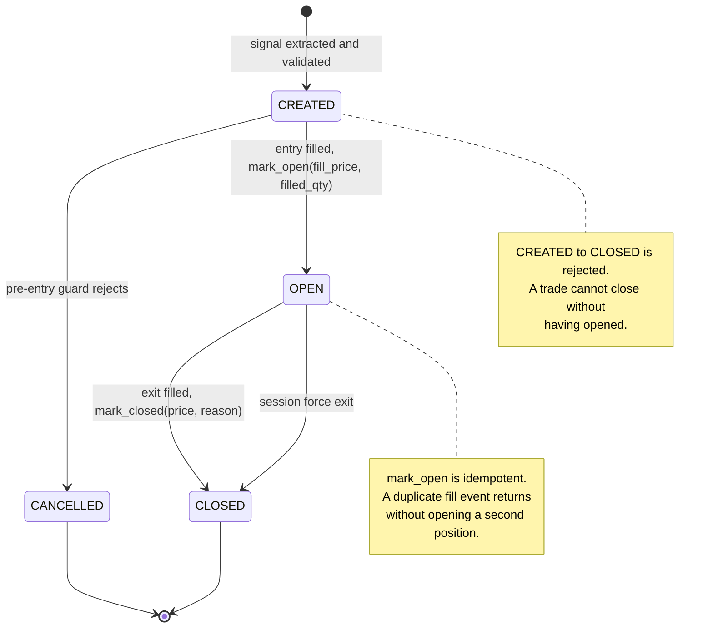
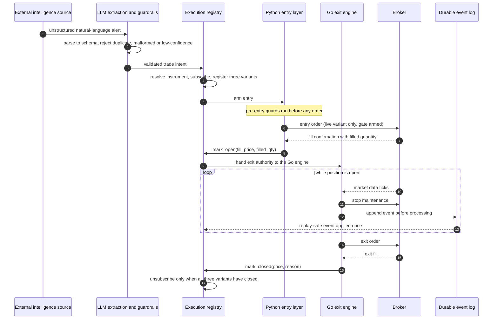

# Order lifecycle

What happens to a signal between arriving and being closed. Trigger conditions and stop
methodology are excluded throughout: this document is the shape of the lifecycle, not the rules
that drive it.

## State machine

Every trade lives in the execution registry as one explicit state. The registry is the only
component allowed to move it.

Three states and two terminal ones is deliberate. Every extra state in an execution path is a
transition somebody has to reason about during a live incident.

## Sequence

The path a single signal takes, with the parallel variants collapsed into one lane for
readability.

## Why authority is split

Entry decisioning exists only in Python, where correctness and readability matter most. Exit is
owned by a separate Go service, because responding to tick data at a consistent latency is the
part that cannot afford an interpreter pause. The registry arbitrates: it hands exit authority
over at fill, and from that point the Go engine is the final authority on exit price. Python
does not override it.

The cost of that split is that two processes share one truth. The durability model in
[DURABILITY.md](DURABILITY.md) is what makes that safe.

## Crash recovery

Recovery is a replay, not a reconstruction. Every lifecycle event is appended to a durable log
before it is processed, so a process that dies mid-trade restarts by replaying the log into the
registry and arrives at the same state it held before. Because each event is idempotent, an
event that was written but only partly processed is applied exactly once on replay.

## Session end

All trades are force-exited ahead of the session close, and every instrument is unsubscribed at
the close. Force exit overrides the normal exit path. An unattended system that can hold a
position past the close is a system that can be surprised overnight.
